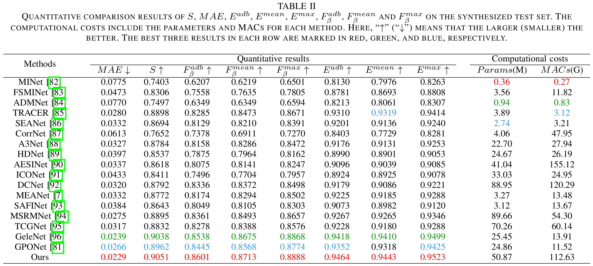
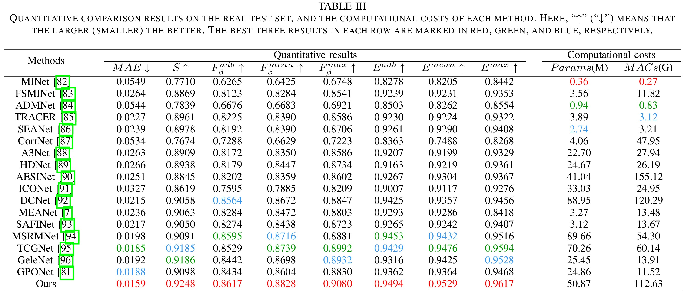

<p align="center">

  <h3 align="center">WXSOD: A Benchmark for Robust Salient Object Detection in Adverse Weather Conditions</h3>

</p>

<p align="center">
  <h3 align="center">(Under Review)</h3>
</p>

<p align="center">
  Quan Chen,&nbsp; Xiong Yang,&nbsp; Rongfeng Lu,&nbsp; Qianyu Zhang,&nbsp; Yu Liu,&nbsp; Xiaofei Zhou,&nbsp; Bolun Zheng
</p>

<p align="center">
  Hangzhou Dianzi University, Tsinghua University, Jiaxing University
</p>

- [x] Part I: WXSOD Dataset
- [x] Part II: Benchmark Results
- [x] Part III: Train and Test
- [x] Part IV: Pre-trained Checkpoints


## 📧 Contact
I am actively seeking academic collaboration. If you’re interested in collaborating or would like to connect, feel free to reach out 😊. 
- Email: chenquan@alu.hdu.edu.cn
- WeChat: cq1045333951 

## <a id="table-of-contents"></a> 📚 Table of contents

- [🌟 Dataset Highlights](#dataset-highlights)
- [💾 Dataset Access](#dataset-access)
- [📁 Dataset Structure](#dataset-structure)
- [🔥 Benchmark Results](#Benchmark-results)
- [🛠️ Requirements](#Requirements)
- [🚀 Train and Test](#train-and-test)
- [🤗 Pre-trained Checkpoints](#pre-trained-checkpoints)
- [🎫 License](#license)
- [🙏 Acknowledgments](#acknowledgments)
- [📌 Citation](#citation)

## <a id="dataset-highlights"></a> 🌟 Dataset Highlights
<b><i>WXSOD</i> dataset</b> provides a large-scale dataset (14,945 RGB images) for salient object detection under extreme weather conditions. Distinguishing itself from existing RGB-SOD benchmarks, it provides images with ​​diverse degradation​​ patterns and ​​pixel-wise annotations​​. Our dataset contains:

- A synthetic training set consisting of 12,891 images, including 8 types of weather noise and a small amount of clean images

- A composite test set consisting of 1,500 images, including 8 types of weather noise and a small amount of clean images

- A real test set consisting of 554 images, including 5 types of weather noise


## <a id="dataset-access"></a> 💾 Dataset Access
The WXSOD dataset is released in two ways:

| [BaiduDisk](https://pan.baidu.com/s/1WU5RE7NBJ2nDvvjixA0RPQ?pwd=hs94) | [Google Drive](https://drive.google.com/file/d/1gCOomZromXYbM29pDjA00NlulzTF4Irw/view?usp=sharing) |[Hugging Face](https://huggingface.co/datasets/C-water/WXSOD)|


## <a id="dataset-structure"></a> 📁 Dataset Structure
```
├─ WXSOD_data
|   ├── train_sys/
|   |   └──input/
|   |       ├── 0001_light.jpg
|   |       └── ...
|   |   └── gt/
|   |       ├── 0001_light.jpg
|   |       └── ...
|   ├── test_sys/
|   |   └──input/
|   |       ├── 0004_clean.jpg
|   |       └── ...
|   |   └── gt/
|   |       ├── 0004_clean.jpg
|   |       └── ...
|   ├── test_real/
|   |   └──input/
|   |       ├── 0001_dark.jpg
|   |       └── ...
|   |   └── gt/
|   |       ├── 0001_dark.jpg
|   |       └── ...
```

## <a id="Benchmark-results"></a> 🔥 Benchmark Results
The prediction results of 18 methods on WXSOD benchmark are available at [Google Drive](https://drive.google.com/file/d/1f6DdsuY7UPvZo68Tk3RJ_FBQNbk9ez1L/view?usp=sharing) and [BaiduDisk](https://pan.baidu.com/s/1AaG64_Ac0MSnE8jLX-YEow?pwd=qhif).

- Quantitative results are derived from the predicted image at the original resolution, while the MACs is measured on a 384×384 image.
- For a fair comparison, all models adopt the unified loss function and learning strategy, with default hyper-parameters.





## <a id="Requirements"></a> 🛠️ Requirements

- torch == 2.1.0+cu121
- timm == 1.0.11
- imgaug == 0.4.0
- pysodmetrics == 1.4.2

## <a id="train-and-test"></a> 🚀 Train and Test

- Train the WFANet.
```
sh run.sh
```

- Generate saliency images based on the weights obtained during the training phase (or the weight we provide).
```
sh runtest.sh
```

- Calculate the quantitative values of WFANet's predicted images.
```
sh runEvaluation.sh
```

## <a id="pre-trained-checkpoints"></a> 🤗 Pre-trained Checkpoints
Pre-training weights for PVTV2-b and WFANet need to be downloaded. The pre-trained weights of ResNet18 can be automatically downloaded through Timm. Remember to modify the weight path!

- The pre-trained backbone PVTV2-b is available at [Google Drive](https://drive.google.com/file/d/1YJY2YPA82kHciRAdIeSqxVPKi42fyO7A/view?usp=sharing) and [BaiduDisk](https://pan.baidu.com/s/1WzPjaeAB6lQ9QcMRx9gwqA?pwd=e73r).

- The pre-trained WFANet is available at [Google Drive](https://drive.google.com/file/d/1tddrGrI8bYXhRgMSyQaVILlDT_lglQop/view?usp=sharing) and [BaiduDisk](https://pan.baidu.com/s/1KJalMeI3mfMmJw2shnrXTg?pwd=6v16).


## <a id="license"></a> 🎫 License
This project is licensed under the [Apache 2.0 license](LICENSE).

## <a id="acknowledgments"></a> 🙏 Acknowledgments 
The scenarios for synthesized data come from:

- [DUTS](https://openaccess.thecvf.com/content_cvpr_2017/papers/Wang_Learning_to_Detect_CVPR_2017_paper.pdf)
- [DUT-O](https://www.cv-foundation.org/openaccess/content_cvpr_2013/papers/Yang_Saliency_Detection_via_2013_CVPR_paper.pdf)
- [ECSSD](https://ieeexplore.ieee.org/abstract/document/7182346)
- [HKU-IS](https://www.cv-foundation.org/openaccess/content_cvpr_2015/papers/Li_Visual_Saliency_Based_2015_CVPR_paper.pdf)
- [VT5000](https://ieeexplore.ieee.org/abstract/document/9767629)


## <a id="citation"></a> 📌 Citation
If you find our repository useful for your research, please consider citing our paper:
```bibtex
@misc{chen2025wxsodbenchmarkrobustsalient,
      title={WXSOD: A Benchmark for Robust Salient Object Detection in Adverse Weather Conditions}, 
      author={Quan Chen and Xiong Yang and Rongfeng Lu and Qianyu Zhang and Yu Liu and Xiaofei Zhou and Bolun Zheng},
      year={2025},
      eprint={2508.12250},
      archivePrefix={arXiv},
      primaryClass={cs.CV},
      url={https://arxiv.org/abs/2508.12250}, 
}
```
